# Playful Plants


## Design / Plan (Milestone 1)

**Make the case for your decisions using concepts from class, as well as other design principles, theories, examples, and cases from outside of class (includes the design prerequisite for this course).**

You can use bullet points and lists, or full paragraphs, or a combo, whichever is appropriate. The writing should be solid draft quality.

### Audiences (Milestone 1)
> Who are your site's audiences?
> Briefly explain who the intended audiences are for your project website.
> **DO NOT INVENT RANDOM AUDIENCES HERE!** Use the audiences from the requirements.

_Consumer_: Parents with developing children
They will be the ones viewing the database to select which plant options are best for their child to be incorperated into their garden. They care more about the play type and growth details of the plant. Parents/families are interested in providing high quality nature-rich places on a smaller scale around their homes and communities. They want to pick plants that will provide year-around interest or help to engage children in gardening projects.

_Site Administrator_: Members of the Playful Plants project
They will be the ones administering the site and making sure that all the information put in is valid and easily editable to add plants to the database.


### _Consumer_ Audience Goals (Milestone 1)
> Document your audience's goals.
> List each goal below. There is no specific number of goals required for this, but you need enough to do the job.
> **DO NOT INVENT RANDOM GOALS HERE OR STEREOTYPE HERE!** Your goals are things that your users want accomplish when using the site (e.g. print a list of plants). These are informed by the Playful Plants objectives. Review the assignment's requirements for details.

_Consumer_ Goal 1: Filter by play type

- **Design Ideas and Choices** _How will you meet those goals in your design?_
  - Reimplement the functionality of the play type filter so that consumers can specifically target plants of a certain play type
- **Rationale & Additional Notes** _Justify your decisions; additional notes._
  - For a parent with probably little to no experience for plant growing, it's better to bring out this information to ensure that they have a smooth journey with developing their garden.
  - Filters allow quicker access to an interested group of plants.

_Consumer_ Goal 2: Filter by growth promotion details of a plant

- **Design Ideas and Choices** _How will you meet those goals in your design?_
  - Filtering form will need to be rebuilt for functionality. It will allow a user to select the plant growth details of interest for them to pick.
- **Rationale & Additional Notes** _Justify your decisions; additional notes._
  - Filters allow quicker access to an interested group of plants.

_Consumer_ Goal 3: See a picture of the plant if there is one in the database

- **Design Ideas and Choices** _How will you meet those goals in your design?_
  - Each snipit of the gallary of plants will provide a preview image if possible of the plant as uploaded by the administrator.
- **Rationale & Additional Notes** _Justify your decisions; additional notes._
  - A small peak can give the user a better understanding of what type of plant it is. A picture is worth a thousand words!

### _Consumer_ Persona (Milestone 1)
> Use the goals you identified above to develop a persona of your site's audience.
> Create your persona using GenderMag's customizable personas.
> Take a screenshot and include it here. Persona must be visible in Markdown Preview; do not use PDF format!
<!-- Source: https://gendermag.org/custom_persona.php -->
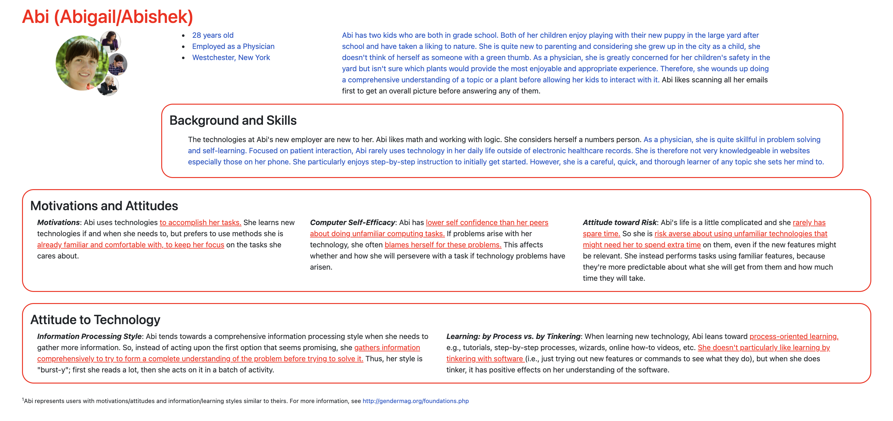
Source: <cite><a href="https://gendermag.org/custom_persona.php">Consumer Persona: Abi</a></cite>

### _Administrator_ Audience Goals (Milestone 1)
> Document your audience's goals.
> List each goal below. There is no specific number of goals required for this, but you need enough to do the job.
> **DO NOT INVENT RANDOM GOALS HERE OR STEREOTYPE HERE!** Your goals are things that your users want accomplish when using the site (e.g. print a list of plants). These are informed by the Playful Plants objectives. Review the assignment's requirements for details.

_Administrator_ Goal 1: To develop/add to a database of playful plants that can support a range of nature play experiences.

- **Design Ideas and Choices** _How will you meet those goals in your design?_
  - Offer sorting methodology that includes organizing plants in alphabetical order by their colloquial and scientific names
  - Including an add plant form that allows the user to update the database with new information that is only seen by admin
- **Rationale & Additional Notes** _Justify your decisions; additional notes._
  - Instead of offering a search bar tool which unfortunately is beyond the scope of this project, sorting by the scientific or colloquial name allows an administrator to quickly check whether or not a plant already exhists in the database and spot it's characteristics.
  - An add form lets the user insert new plant and plant information in the database -- build more to accomplish their overall goal of supporting this playful plants database.

_Administrator_ Goal 2: To edit a particular plant's basic information (ex. name) and tags

- **Design Ideas and Choices** _How will you meet those goals in your design?_
  - Details of the growth preferences (sunlight, time of the year, hardiness zone) are provided to the consumer AND admin. For users that are interested in growing these plants, these details and tags are essentially to a successful development of their garden that they hoped to extract from this database. Tim will need this information to easily reference if a plant needs changes. It helps him test his functionality on the website as the gallary's quick details provide more usability.
  - Filtering for these growth details are also available.
  - Once confirmed that the user is an administrator (based off the login page) each plant will have an edit page
- **Rationale & Additional Notes** _Justify your decisions; additional notes._
  - Users will also be able to filter based on the specific growth conditions they support. Such as the different classifications of a plant (ex. if a user only wants flowers or trees, they're able to just look at plants that are under that class).
  - In case someone makes a mistake or there is a better image to be uploaded or if there's a tag or basic name to change, this edit form will allow for users to change an entry.

_Administrator_ Goal 3: To delete a plant entry if necessary.

- **Design Ideas and Choices** _How will you meet those goals in your design?_
  - Once an administrator is logged in, there are buttons that allow them to delete a specific plant
- **Rationale & Additional Notes** _Justify your decisions; additional notes._
  - If a plant is no longer supported in the playful plants database, it makes sense that it cannot be in the database any longer to avoid confusing the consumer.


### _Administrator_ Persona (Milestone 1)
> Use the goals you identified above to develop a persona of your site's audience.
> Create your persona using GenderMag's customizable personas.
> Take a screenshot and include it here. Persona must be visible in Markdown Preview; do not use PDF format!
<!-- Source: https://gendermag.org/custom_persona.php -->
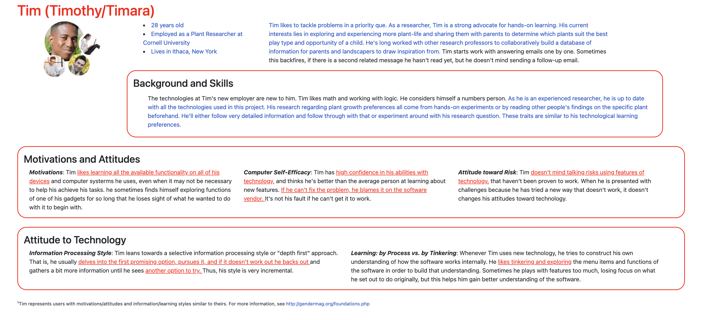
Source: <cite><a href="https://gendermag.org/custom_persona.php">Administrator Persona: Tim</a></cite>


### Site Design (Milestone 1)
> Document your _entire_ design process. **We want to see iteration!**
> **Show us the evolution of your design from your first idea (sketch) to the final design you plan to implement (sketch).**
> **Show us how you decided what data to display to each audience.**
> **Plan your URLs for the site.**
> **Provide a brief explanation _underneath_ each design artifact (2-3 sentences).** Explain what the artifact is, how it meets the goals of your personas (**refer to your personas by name**).
>
> **Important!** Plan _all_ site requirements. Don't forget login and logout.

_Initial Designs / Design Iterations:_
<!-- Source: (original work) Stephanie Zhang -->
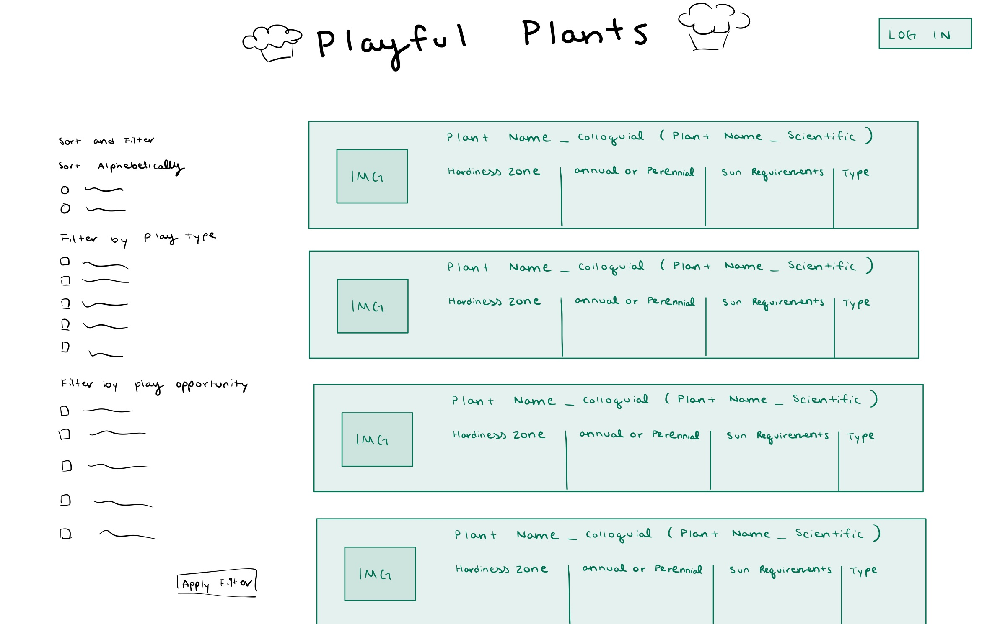
The intial home page can have all the different plants show. However, the form to add a new plant is not made available until a user is logged in.
<!-- Source: (original work) Stephanie Zhang -->
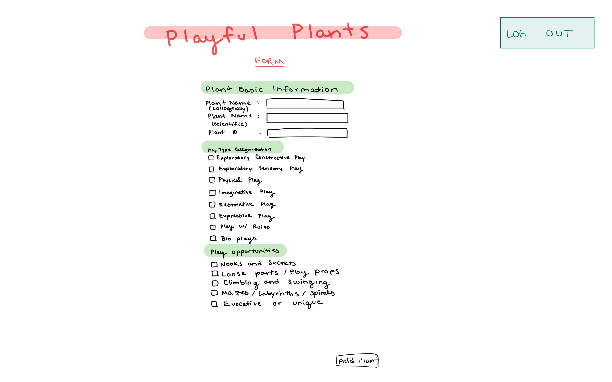
This form and tab will only be visible when an administrator is logged in. In this case, in place of the login button, the logout button is used instead.
<!-- Source: (original work) Stephanie Zhang -->
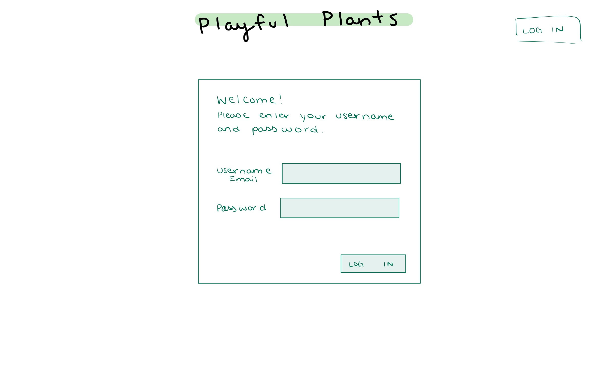
The log in page will be made anew as the login button is pressed.
<!-- Source: (original work) Stephanie Zhang -->
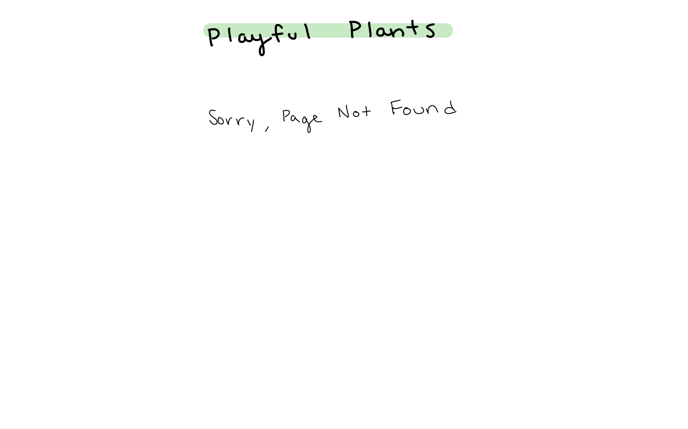
Following the 404 page design from the previous project. It'll redirect the user back to the home page.
<!-- Source: (original work) Stephanie Zhang -->
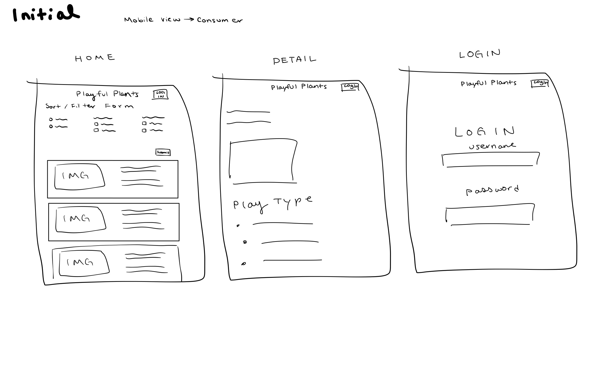
A lot of screens are left aligned and the column feature of flexboxes are used a lot to conserve for the reduced width space. The login page is still a separate page.
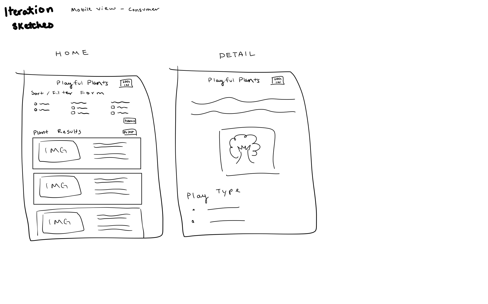
Realized the mobile version from the consumer's point of view wouldn't need to login but the login page will be designed similar to the initial design above.
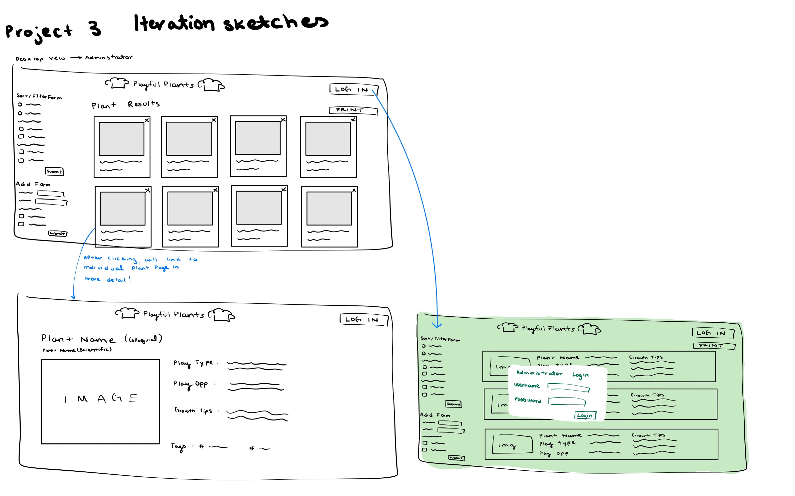
Some previous ideas from prior milestones where the login page was a pop up. I made it a separate page as my research showed that it is also a familar design.


_Final Design:_
<!-- Source: (original work) Stephanie Zhang -->
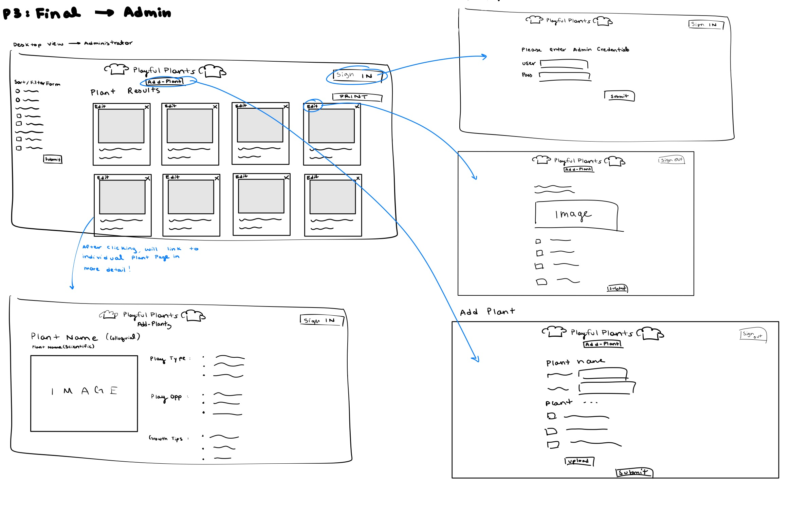
Comments written in the design itself.
The login will be an entirely new page as stated for the resons above. The urls for these sites will be as follows
- home.php: "/"
- detailed.php: "/detailed?id= (plant id)"
- update.php: "/update?id= (plant id)"
- login.php: "/login"
- form.php: "/add-plant"
<!-- Source: (original work) Stephanie Zhang -->
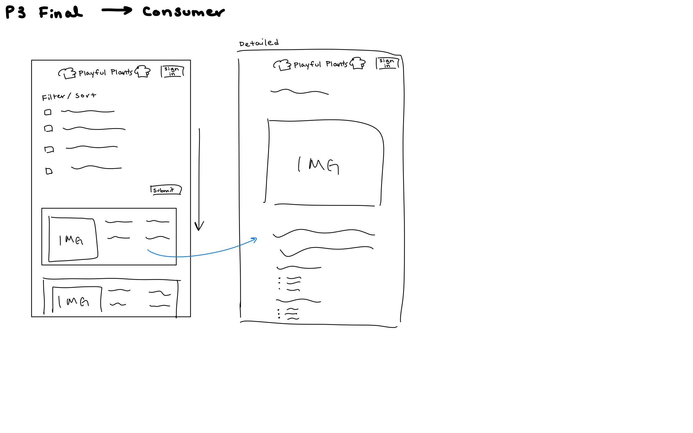
The detailed page will feature more centered text such that there are no awkward chunks of white space on the page.
Instead of the login page being an entirely new page. It will appear as a pop up over the other elements of the home page using JavaScript.

### Design Pattern Explanation/Reflection (Milestone 1)
> Write a one paragraph (6-8 sentences) reflection explaining how you used design patterns for media catalogs in your site's final design.

In the administrator view, Tim is able to access many more links and buttons such as the edit and delete for each plant. This familar design of having a hidden button/link encouraged me to keep the add-plant form a separate page. Once Tim logs in, his curious nature and love of learning of all availability functionality is supported due to the visible change of the screen with an additional link to the add-plant form. These buttons also better guide him through his tinkering and exploration of the website as it follows more of a traditional and familiar design of these database websites. Abi is tech-savy but is more likely to blame herself if the technology fails to work so I've incorperated feedback messages on all my forms (filter). These feedback messages on the admin side also help Tim in the edit form, add form, and filter form as his learning is more selective. He'll incorporate those feedback messages into his behavior right away after learning this new piece of information. It is also helpful that Tim's website contains EVERYTHING from Abi's side because it better helps him support his consumers. It's easier for him to spot a mistake in a tag or name of a plant from the gallary which would prompt him to go in and edit the database using the edit form. My original designs suggested that Tim would find the plant tags unhelpful and unsupportive but in reality, while he doesn't gain much functional use from them in his garden, he would more easily see all the displays of a plant to help him better categorize and organize his available features on the website.


### Cognitive Styles Explanation/Reflection (Milestone 1)
> Write a one paragraph (6-8 sentences) reflection explaining how your final design supports the cognitive styles of each persona.

_Consumer Cognitive Styles Reflection:_

Abi's cognitive style shows that she has a strong strength in learning. She likes to learn about topics in depth and follows a more congnitive information processing approach. To reflect this, the initial home page will display all the different plants made availible in the playful plant website such that she's able to learn about the diverse offering the database has to offer. Despite being a comprehensive learner, Abi uses technology to accomplish her tasks and appreciates following an process-oriented fashion. To appeal to this, many familiar media catalog designs are employed in order to ensure she has the smoothest experience such as having the filtering catalog to the side of the displays. Secondly, using these familiar designs can help with her very risk-adverse attitude when it comes to learning and following new technologies. In order to ensure she is able to access all the parts of the website that fit her goals without confusing her further with the website's administrator abilities, the options to login as an administrator would only be encouraged to non customers with a detailed message as to why to log in. This way, Abi wouldn't need to concern herself with the add plant forms and other complicated functions in the website.


_Site Administrator Cognitive Styles Reflection:_

Tim is motivated to learn all the availible functionality of his devices (and this website!) so as an administrator, all the tasks he needs to accomplish with his goals should be clearly labeled such as being able to add a new plant or prompting a print function. He's quite familiar with technology so the familiar media catalog design would only further benefit his user experience on the website. Clearly labeling all the different tabs and their basic function supports his processing style which is selective. When he visits the website, he has a specific task in midn and he's able to selectively achieve it efficiently with a quick tab access. The website's different filters and sorts can definitely more easily help with his love for tinkering and learning by himself on the website.


## Implementation Plan (Milestone 1, Milestone 2, Milestone 3, Final Submission)

### Database Schema (Milestone 1)
> Describe the structure of your database. You may use words or a picture. A bulleted list is probably the simplest way to do this. Make sure you include constraints for each field.
> **Hint: You probably need a table for "entries", `tags`, `"entry"_tags`** (stores relationship between entries and tags), and a `users` tables.
> **Hint: For foreign keys, use the singular name of the table + _id.** For example: `image_id` and `tag_id` for the `image_tags` (tags for each image) table.

<!-- For Login Stuff -->
Table: users
- id: INTEGER {NN, PK, AI, U},
- username: TEXT {NN, U},
- password: TEXT {NN, U}

Table: sessions
- id
- user_id
- session
- last_login

user_id is a foreign key to the users table!

Table: classifications
- id: INTEGER {NN, PK, AI, U},
- classificationname: TEXT {NN, U}

Table: details
- id: INTEGER {NN, PK, AI, U},
- detailname: TEXT {NN, U}

Table: plants
- id: INTEGER {NN, PK, AI, U},
- plant_name_c: TEXT {NN, U},
- plant_name_s: TEXT {NN, U},
- plant_id: TEXT {NN, U},
- hardiness_zone_range: TEXT {NN},

- constructive_play: INTEGER {NN},
- sensory_play: INTEGER {NN},
- physical_play: INTEGER {NN},
- imaginative_play: INTEGER {NN},
- restorative_play: INTEGER {NN},
- expressive_play: INTEGER {NN},
- rule_play: INTEGER {NN},
- bio_play: INTEGER {NN},

Table: classification_tags
- id: INTEGER {NN, PK, AI, U},
- plant_id: INTEGER {NN},
- classification_id: INTEGER {NN}

- plant_id is a foreign key referencing the plants table
- classification_id is a foreign key referencing the classifications table


Table: detail_tags
- id: INTEGER {NN, PK, AI, U},
- plant_id: INTEGER {NN, U}
- detail_id : INTEGER {NN}

- plant_id is a foreign key referencing the plants table
- detail_id is a foreign key referencing the details table

Table: images
- id: INTEGER {NN, PK, AI, U},
- plant_id: INTEGER {NN, U}
- extension: TEXT {NN}

- plant_id is a foreign key referencing the plants table


### Database Query Plan (Milestone 1, Milestone 2, Milestone 3, Final Submission)
> Plan _all_ of your database queries. You may use natural language, pseudocode, or SQL.

#### Page: Home
NATURAL LANGUAGE VERSION
```
SELECT plants.id, plants.plant_name_colloquial... (all fields), classifications(all fields except id), classification_tags (all fields except id), details(all fields except id), details_tags(all fields except id),
FROM plants
INNER JOIN classification_tags ON plants.id = classification_tags.id
INNER JOIN classification ON classification.id = classification_tags.id
INNER JOIN details_tags ON plants.id = details_tags.id
INNER JOIN details ON details.id = details_tags.id

GROUP BY plants.id
```

SQL VERSION --> Tested with DB Browser for SQLite
```
SELECT plants.id as "plants.id", plants.plant_name_c as "plants.plant_name_c", plants.plant_name_s as "plants.plant_name_s",  plants.plant_image as "plants.plant_image", plants.hardiness_zone_range as "plants.hardiness_zone_range", plants.constructive_play as "plants.constructive_play", plants.sensory_play as "plants.sensory_play" , plants.physical_play as "plants.physical_play", plants.imaginative_play as "plants.imaginative_play", plants.restorative_play as "plants.restorative_play", plants.expressive_play as "plants.expressive_play" , plants.play_with_rules as "plants.play_with_rules", plants.bio_play as "plants.bio_play", classification_tags.classification_id as "classification_tags.classification_id", classifications.classificationname as "classifications.classificationname", detail_tags.detail_id as "detail_tags.detail_id", details.detailname as "details.detailname"

FROM plants
INNER JOIN classification_tags ON (plants.id = classification_tags.plant_id)
INNER JOIN classifications ON (classification_tags.classification_id = classifications.id)
INNER JOIN detail_tags ON (plants.id = detail_tags.plant_id)
INNER JOIN details ON (detail_tags.detail_id = details.id);

GROUP BY plants.id // to prevent multiple gallery items for each plant just because there are multiple records per plant
```

#### Page: Edit/Update for each specific plant
To pull all information on the plant that is exhisting
NATURAL LANGUAGE VERSION
```
UPDATE plants SET fields --> respective params
```
SQL VERSION --> Tested with DB Browser for SQLite
```
'UPDATE plants SET plant_name_c = :plant_name_c, plant_name_s = :plant_name_s, plant_image = :plant_image, hardiness_zone_range = :hardiness, constructive_play = :constructive_play, sensory_play = :sensory_play, physical_play = :physical_play, imaginative_play = :imaginative_play, restorative_play = :restorative_play, expressive_play = :expressive_play, play_with_rules = :play_with_rules, bio_play = :bio_play WHERE (id= :id);'
```

To update the classifications and growth details
NATURAL LANGUAGE VERSION
```
DELETE FROM classification_tags / detail_tags WHERE (plants.id = plants.id from the );
```
SQL VERSION --> Tested with DB Browser for SQLite
```
DELETE FROM classification_tags / detail_tags WHERE (plant_id = :id)
```

#### Page: Detailed for each specific plant
NATURAL LANGUAGE VERSION
```
Same as the home but the new WHERE condition is that the id matches the requested id from the get request
```
SQL VERSION --> Tested with DB Browser for SQLite
```
SELECT plants.id as "plants.id", plants.plant_name_c as "plants.plant_name_c", plants.plant_name_s as "plants.plant_name_s",  plants.plant_image as "plants.plant_image", plants.hardiness_zone_range as "plants.hardiness_zone_range", plants.constructive_play as "plants.constructive_play", plants.sensory_play as "plants.sensory_play" , plants.physical_play as "plants.physical_play", plants.imaginative_play as "plants.imaginative_play", plants.restorative_play as "plants.restorative_play", plants.expressive_play as "plants.expressive_play" , plants.play_with_rules as "plants.play_with_rules", plants.bio_play as "plants.bio_play", classification_tags.classification_id as "classification_tags.classification_id", classifications.classificationname as "classifications.classificationname", detail_tags.detail_id as "detail_tags.detail_id", details.detailname as "details.detailname" FROM plants INNER JOIN classification_tags ON (plants.id = classification_tags.plant_id) INNER JOIN classifications ON (classification_tags.classification_id = classifications.id) INNER JOIN detail_tags ON (plants.id = detail_tags.plant_id) INNER JOIN details ON (detail_tags.detail_id = details.id) WHERE (plants.id = :id);
```

#### Function: Delete an Entry
NATURAL LANGUAGE VERSION
```
$id = the POST request id for a plant

// delete from the joined tables first
DELETE FROM classification_tags WHERE (plant_id = $id);
DELETE FROM detail_tags WHERE (plant_id = $id);
// delete from main table LAST
DELETE FROM plants WHERE (id = $id);

also remove the image file associated with the plant from the repo
```
SQL VERSION --> Tested with DB Browser for SQLite
```
DELETE FROM classification_tags WHERE (plant_id = :id);
DELETE FROM detail_tags WHERE (plant_id = :id);
DELETE FROM plants WHERE (id = :id);
```

### Code Planning (Milestone 1, Milestone 2, Milestone 3, Final Submission)
> Plan any PHP code you'll need here using pseudocode.
> Tip: Break this up by pages. It makes it easier to plan.

#### Home Page Logic
```
// log in display live view display
if not logged in{
  hidden is kept in the add-plant form's class
  the button in the header still says "log in"
  the information of the growing tips of each plant are still displayed
}
hidden is removed from the add-plant form's class
the button in the header says "log out"
information of the growing tips for each plant is not displayed

// filter and sort form
if these forms are submitted, keep track of all the values that are submitted
double check that the form is considered a valid submission
if a valid submission, append more specific details of the filter or function that it entails and append that to the current sql query
and return a confirmation message

//gallary items
query the database properly --> according to query pseudo code above --> will test with DB Browser SQLite before applying
for each record in record
  create a div that displays: image, colloquial name, scientific name, plant ID, and playtypes, classification, and growth details

  for fetching the image, test if the image path exists with the plant_id parameter, if it doesn't exist, use the default no image

//print button
once image is pressed, the link to trigger it sets up from the print page from the window
onClick="window.print()
```

#### Detailed Page Logic
```
the url of this page for each detailed plant corresponds to its id in the plant database so extract that properly
- using a get request-
query all information of the plant --> follow the query code for the specific detailed page --> notice how the only difference from the home page is the extra WHERE parts that specifies the ID of the plant that it's observing once the gallary image is clicked

echo out the play type of the plants too

start an unordered list
for each tag in the tags extracted (from each of the different records for one plant due to all the linkages between tables)
  create a new bullet point for each tag corresponding with that id
```

#### Edit/Update Page Logic
* Edit the plant entry in its own separate page now -- refined this design decision since consumers aren't allowed to see this functionality anyway --> is illustrated in the sketch iteration

```
confirmation's hidden class is set

set variables to empty or null
set sticky variables to empty

detailed_id = the id of the plant that the original edit page is opened for
update_id = the id of the plant that the update form is editing -- collected via the submission of the form

//double check which version of the plant information to pull
if (update_plant){
  execute SQL query for entire page to fetch the plant record it is going to edit
  set record equal to the first param of all the records fetched
} else (detailed_id){
  //this is what is executed when the edit page is first clicked, the code from this will run to support the initial page
  execute SQL query for entire page to fetch the plant record it's displaying
  set record equal to the first param of all the records fetched
}

if (there's a record fetched from the above query){
  set variables to the queried record result
  for each classification
    loop through and mark their values 'checked' if they are in the record
  for each growth detail
    loop through and mark their values 'checked' if they are in the record

  set sticky values to the values above respectively --> This ensures that when you first click into the plant, the name, playtype, classifications, and growth details from the database are ALREADY checked and marked --> Help with usability of the user so they don't have to retype and check everything

  feedback classes
  - plant names = 'hidden'
  - play type = 'hidden'
  - classifications = 'hidden'
  - details = 'hidden'

  if ( post request of the update id is collected ){
  update variable values to those from the submitted form using post requests

  array of total classifications checked
    for each classification, if one is checked, append the foreign key for that classification into the array
  array of total details checked
    for each detail, if one is checked, append the foreign key for that detail into the array

  form_valid = true;

  if (any basic names are empty){
    form_valid = false;
    // MUST ALSO ADD A VERIFICATION THAT the newly editted plant is not somehow the same plant as a plant that already exists in the database!!
  }
  if (no play types are checked){
    form_valid = false;
  }
  if (no classifications checked){
    form_valid = false;
  }
  if (no growth details checked){
    form_valid = false;
  }

  if (form_valid){
    //execute sql queries
    UPDATE plants table with information collected from the post requests (plant names and play types)

    DELETE current existing entries of classifications for this specific plant from the classification_tags table
    for each classification in the array of total classifications{
      INSERT into classification_id values (id from this plant (get from url), the array value in total classifications)
    }
    DELETE current existing entries of details for this specific plant from the detail_tags table
    for each detail in the array of total details{
      INSERT into detail_id values (id from this plant (get from url), the array value in total details)
    }

    if all these SQL queries work{
      confirmation's hidden class will be removed
    }
  } else {
    //in the case that the form is NOT Valid
    sticky values are all set to the currently fetched values from post request
    the form HTML will echo out the value of the sticky which will only be displayed if the form was invalid/the information was not entered correctly
  }

  if (form_valid){
    confirmation message's hidden class is removed!!
  } else {
    sticky form and HTML for form
  }
}

}
```

#### Add Form -Upload Page Logic
```
set variables to just null or empty
set sticky variables to null

css classes for feedback messages
- names = 'hidden'
- play type = 'hidden'
- plant classification = 'hidden'
- plant details = 'hidden'

if (add form is submitted){
  set variables from the form to the appropriate values from the post request of the form

  create array to store all the classifications checked
  - loop through each value of from the post request and append the appropriate classification id into the array
  create array to store all the details checked
  - loop through each value of from the post request and append the appropriate detail id into the array

  form_valid = true
  if (any of the names are empty){
    form_valid = false
    names feedback = ''
  }
  if (none of the play types are checked){
    form_valid = false
    play type feedback = ''
  }
  if (none of the plant classifications are checked){
    form_valid = false
    play classification feedback = ''
  }
  if (none of the plant details are checked){
    form_valid = false
    play details = ''
  }

  if (form_valid){
    //insert values into the database tables!!
    //insert into plant first
    sql_insert_plant = "INSERT INTO plants VALUES (plant names, play types, hardiness zone range)"
    execute this sql query with the correct params from the post requests set earlier

    $justinsertedID = use the lastInsertID() function to fetch the id of the plant just added to the plants table --> to be used as foreign key

    // insert into classification_tags table
    for each classification in the total classification array created once the form was submitted{
      sql_insert_classification = "INSERT INTO classification_tags VALUES ($justinsertedID, $classification)"
      execute the sql query above
    }

    // insert into detail_tags table
    for each detail in the total details array created once the form was submitted{
      sql_insert_classification = "INSERT INTO detail_tags VALUES ($justinsertedID, $detail)"
      execute the sql query above
    }
  } else {
    sticky values are set to the post request values
  }
}
  form will echo out all the sticky values regardless
    - if the form was valid, will return an empty new form because the sticky value was never set to a value
    - if the form was invalid, will return the previously attempted submission because of the last else branch
```

#### Log in pop up
```
if (entered credentials DOES NOT match an existing and valid one in the database){
  if (username doesn't exist){
    Do not sticky anything
    Add message above username bar that says that the user does not exist
  }
  if (password doesn't match a username){
    Do not sticky anything
    Add message above password bar that says that the incorrect password was entered
  }
}
reloads back to home page and a user can tell they're signed in due to the sign out button in the top right.
the information of the growing tips of each plant are not displayed
the add-plant form is for display

```


### Accessibility Audit (Final Submission)
> Tell us what issues you discovered during your accessibility audit.
> What do you do to improve the accessibility of your site?

During my accessibility audit, I noticed a lot of problems with the lack of titles in my multi-paged website. It made me realize the importance of specifying which action and the purpose of each page especially considering how Abi is more familar with this design process where the tab name will suggest the purpose and function of each tab.

Ways to improve accesssibility of my site include the adding of descriptive titles to each of the websites that are linked to each individual plant. For example, my titles and URLs for my detailed pages and editable pages do not have the most descriptive titles and that could be improved. I'm clad this WAVE accessibility audit caught this error because it is something quite small that I surely would have missed. Going forward with this project, I'll take that into consideration.


## Reflection (Final Submission)

### Audience (Final Submission)
> Tell us how your final site meets the goals of your audiences. Be specific here. Tell us how you tailored your design, content, etc. to make your website usable for your personas.

Administrator: The final site here meets the goals of the administrator because of the additional functionalities made available once the user logs in using the admin credentials. Users are able to view all the details of the plant and have full control over which records and tags are being seen about a plant. They're able to input new plants into the database, remove old ones, update them and essentially work out the detais of each plant.

Consumer: The final site supports the goals of this audience because of the user-friendly mobile design, the ability to access a print function that can print out the plant results, the details of each plant is shown right there in the gallery and they're able to observe it to a closer extent in the detailed page of a plant and that the filters and sorts help a consumer quickly tailor the database to their needs.


### Additional Design Justifications (Final Submission)
> If you feel like you haven’t fully explained your design choices in the final submission, or you want to explain some functions in your site (e.g., if you feel like you make a special design choice which might not meet the final requirement), you can use the additional design justifications to justify your design choices. Remember, this is place for you to justify your design choices which you haven’t covered in the design journey. You don’t need to fill out this section if you think all design choices have been well explained in the design journey.

I still included my plant add form to a new separate page because of the restriction of Admin Only. I thought that the new link and restriction made it more similar to the other buttons and links that would appear when a user logged in such as with edit and delete. To keep the design consistent, it made sense to me that the add form is on a different page.


### Self-Reflection (Final Submission)
> Reflect on what you learned during this assignment. How have you improved from Project 2? What would you do differently next time?

I was able to speed up the time for querying my tables by taking full advantage of inner joins. I'm able to execute multiple SQL queries at a time to perform an audience goal and the logic for this project was far more complex to grasp compared to project 2. Something I would do differently next time is maybe going through the code to make sure that everything is as efficient as possible. I have a lot of for loops in this and I often feel like I'd doing the same thing again. Because of the difficult logic, it was difficult for me to safely assume the existance of a variable so while debugging, I noticed some extracted variables were not as efficient as they could have been. I also built a lot of arrays so it'd be interesting to see how that ever got to becoming more efficient.


> Take some time here to reflect on how much you've learned since you started this class. It's often easy to ignore our own progress. Take a moment and think about your accomplishments in this class. Hopefully you'll recognize that you've accomplished a lot and that you should be very proud of those accomplishments!

This project was a huge test of my knowledge. I had no idea that actually implementing these functionalities would be possible from a student of INFO 2300 when we first started. I believe it's a big step up from the previous two projects and after meeting so many new prople from office hours there struggling with the same problems, we realized we were all in it together. This customization of admin vs consumer views and executing multiple SQL joins and queries in the same document was difficult to wrap my brain around at first but it made a lot more sense as we worked on the project. This project is something I'm very proud of this semester and represents the fruits of my labor from this class.


### Grading: Step-by-Step Instructions (Final Submission)
> Write step-by-step instructions for the graders.
> The project if very hard to grade if we don't understand how your site works.
> For example, you must login before you can delete.
> For each set of instructions, assume the grader is starting from /

_View all entries:_

1. Open in VSCode
2. Reopen in Container
3. Run -> Start Debugging

_View all entries for a tag:_

1. On the home page, there is a filter and sort form to the side. One can pick up whichever order of the plant they want based on colloquial or scientific name, however many play types, one classification, and one growth promotion detail at a time.
2. Press submit. The gallary will display plants that have ALL the qualities filtered for.

_View a single entry's details:_

1. Click on any plant in the gallery to retrieve the specific detail page of that plant.

_How to insert and upload a new entry:_

1. Log in with Admin credentials (username: stephanie password: monkey)
2. Click the Add - Plant link under the title.

_How to delete an entry:_

1. Login with Admin credentials (username: stephanie password: monkey)
2. Click the X button of a plant in the gallery.
3. Click the confirm button on the pop up.

_How to edit and existing entry and its tags:_

1. Login with Admin credentials (username: stephanie password: monkey)
2. Click the "Edit" button of a plant in the gallery.
3. Submit the form.

